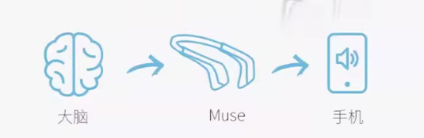
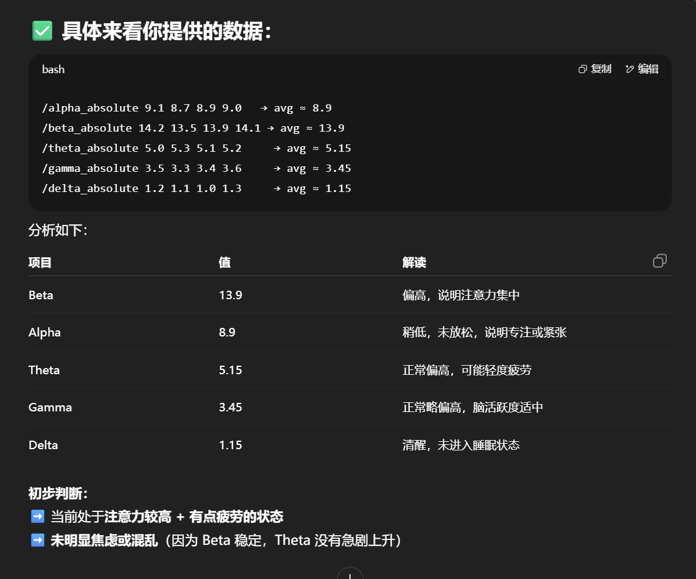

## 1.购买Muse2设备

## 2.拿到Muse2设备提供是eeg脑电数据

✔️  Muse 2 是目前性价比最高的 EEG 成品设备，支持原始脑波数据采集（通过 Mind Monitor）
✔️ 非侵入式、可穿戴，正适合你做阿尔茨海默症智能辅助系统的原型演示




OSC 数据帧样例

```bash
/alpha_absolute 9.1 8.7 8.9 9.0
/beta_absolute 14.2 13.5 13.9 14.1
/theta_absolute 5.0 5.3 5.1 5.2
/gamma_absolute 3.5 3.3 3.4 3.6
/delta_absolute 1.2 1.1 1.0 1.3
/eeg 123 -35 -40 45 -38
/acc 0.02 -0.01 0.99
/gyro 0.000 0.001 -0.001

```



## 3.发送【脑电数据】给本地电脑的 Python 程序进行二次开发

### 3.1 GPS 功能

### 3.2 AI智能语音系统

### 3.3 家人端实时数据同步